### Machine Learning

## Learning Outcomes 
1. Articulate the legal, social, ethical and professional issues faced by machine learning professionals.
2. Understand the applicability and challenges associated with different datasets for the use of machine learning algorithms.
3. Apply and critically appraise machine learning techniques to real-world problems, particularly where technical risk and uncertainty is involved.
4. Systematically develop and implement the skills required to be effective member of a development team in a virtual professional environment, adopting real-life perspectives on team roles and organisation.

## Units 1-3: The 4th Industrial Revolution 
Schwab (2016) argues that the Fourth Industrial Revolution will fundamentally alter the way we exist and that the response to it needs to be integrated, comprehensive, and inclusive of all relevant stakeholders. He also argues that the speed of these breakthroughs has no historical precedent (Schwab, 2016). This is evident in the increasing reliance on technology, particularly telecommunication and the internet. Millions of people are now connected to the internet via mobile phones augmented with AI, forming a complex structural web (Schwab, 2016). 

The critical dependence on the Internet of Things (IoT) was illustrated during one of the most significant telecommunication outages in recent Australian history. In 2023, ten million Optus users were left without phone coverage or internet (Sharwood, 2023; Farrer & Taylor, 2023). The outage had far-reaching consequences, halting key government services such as transport and health (Farrer & Taylor, 2023) and disrupting SMS authentication and payment systems (Clark, 2024). It was reported that 228 triple-0 emergency calls could not connect, leaving individuals unable to contact emergency services (Williams, 2023).

The fallout from the outage was extensive, leading to the government reconsidering contracts with Optus (Farrer & Taylor, 2023), the resignation of the company’s CEO, a $40 million financial loss, 2% decline in business, and multiple investigations into the incident (Clark, 2024). The outage was attributed to a botched software update caused by human error, resulting in a cascading failure when routing information exceeded preset safety levels on key routers. Experts noted that more robust testing processes, such as internal system tests and router evaluations, could have prevented the incident (Gregory, 2023; Page, 2023).

Furthermore, an inquiry by the Australian Senate revealed that Optus had no contingency plan for large-scale outages (Page, 2023). The review emphasized the need for the Australian Government to improve oversight of telecommunication providers, especially concerning emergency services, and to establish stronger protocols for responding to national service outages (Australian Government, 2024).

The Optus outage highlights the vulnerabilities of modern societies reliance on IoT and telecommunication networks. It highlights the importance of robust testing protocols, effective contingency plans, and proactive government oversight to prevent and mitigate the consequences of such failures. 

Reference list:

1.	Australian Government (2024). Review into the Optus outage of 8 November 2023 – Recommendations. [online] Department of Infrastructure, Transport, Regional Development, Communications and the Arts. Available at: https://www.infrastructure.gov.au/department/media/publications/review-optus-outage-8-november-2023-recommendations.
2.	Clark, R. (2024). Optus network crash cost the company $40M. [online] Lightreading.com. Available at: https://www.lightreading.com/finance/optus-network-crash-cost-the-company-40m.
3.	Farrer, M. and Taylor, J. (2023). Half of Australia left without internet or phone as Optus crashes. [online] The Guardian. Available at: https://www.theguardian.com/business/2023/nov/08/half-of-australia-left-without-internet-or-phone-as-optus-crashes.
4.	Gregory, M.A. (2023). An Analysis of the Optus National Outage and Recommendations for Enhanced Regulation. Australian Journal of Telecommunications and the Digital Economy, 11(4), pp.185–198. doi:https://doi.org/10.18080/jtde.v11n4.898.
5.	Page, R. (2023). What CIOs can learn from the massive Optus outage. [online] CIO. Available at: https://www.cio.com/article/1249111/what-cios-can-learn-from-the-massive-optus-outage.html.
6.	Perfetto, I. (2023). The cause behind the Optus outage explained. [online] cosmosmagazine.com. Available at: https://cosmosmagazine.com/technology/internet/the-cause-behind-the-optus-outage-explained/.
7.	Schwab, K. (2016). The Fourth Industrial Revolution: what it means and how to respond. [online] World Economic Forum. Available at: https://www.weforum.org/stories/2016/01/the-fourth-industrial-revolution-what-it-means-and-how-to-respond/.
8.	Sharwood, S. (2023). Telco CEO quits after admitting she needs to carry rivals’ SIM cards to stay in touch. [online] Theregister.com. Available at: https://www.theregister.com/2023/11/21/optus_ceo_quits/.
9.	Williams, T. (2023). Urgent meetings, router resets and 400 workers: Behind the scenes of the Optus outage. ABC News. [online] 22 Nov. Available at: https://www.abc.net.au/news/2023-11-22/optus-outage-documents-behind-the-scenes-two-weeks-since/103130998.

## Unit 2: EDA Tutorial

In this unit we were encouraged to perform EDA on the Auto-MPG dataset:

Identify missing values:

Estimate Skewness and Kurtosis:

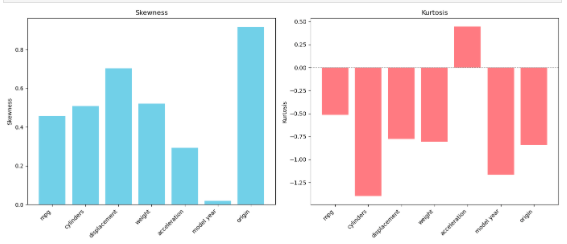

Correlation Heat Map:

Plots for different parameters:

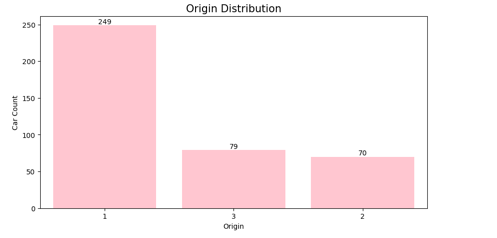

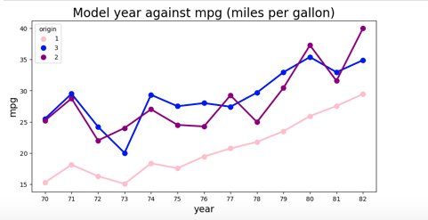

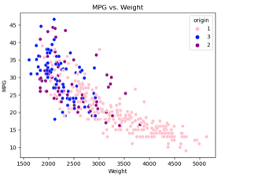

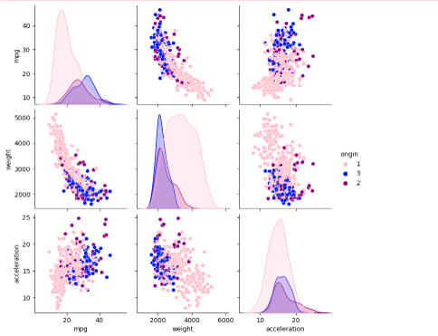

Replace categorical values with numerical values (i.e., America 1, Europe 2 etc.):

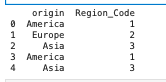

All code can be found here: 

[Unit 2 Notebook](https://github.com/RalucaGH/RG/blob/main/assets/ml/unit2ML.ipynb)

## Unit 3: Correlation and Regression
In this unit we used jupyter notebooks to modify the parameters and observe how the changes in data affects correlation and regression.

1. Pearson correlation - Below you can see the changes to the correlation due to changing of covariance:
   
 

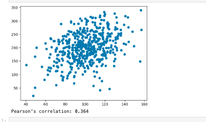

You can check the rest of the experiments below:

[Unit 3 Notebook 1](https://github.com/RalucaGH/RG/blob/main/assets/ml/Unit03Ex1covariance_pearson_correlation_done.ipynb)

2. Linear regression - Below you can see the changes to the linear regression due to adding of random noise:
   
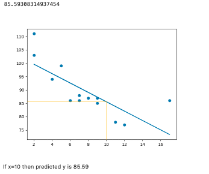

You can check the rest of the experiments below:

[Unit 3 Notebook 2](https://github.com/RalucaGH/RG/blob/main/assets/ml/Unit03Ex2linear_regression_done.ipynb)

3. Multiple Linear regression - Below you can see the changes to the multiple linear regression:

[Unit 3 Notebook 3](https://github.com/RalucaGH/RG/blob/main/assets/ml/Unit03Ex3multiple_linear_regressiondone.ipynb)

4. Polynomial regression - Below you can see the changes to the polynomial regression:
   
[Unit 3 Notebook 4](https://github.com/RalucaGH/RG/blob/main/assets/ml/Unit03Ex4polynomial_regression_done.ipynb)

## Unit 5: Jaccard Coefficient Calculations

In this unit we learned how to calculate the Jaccard Coefficient

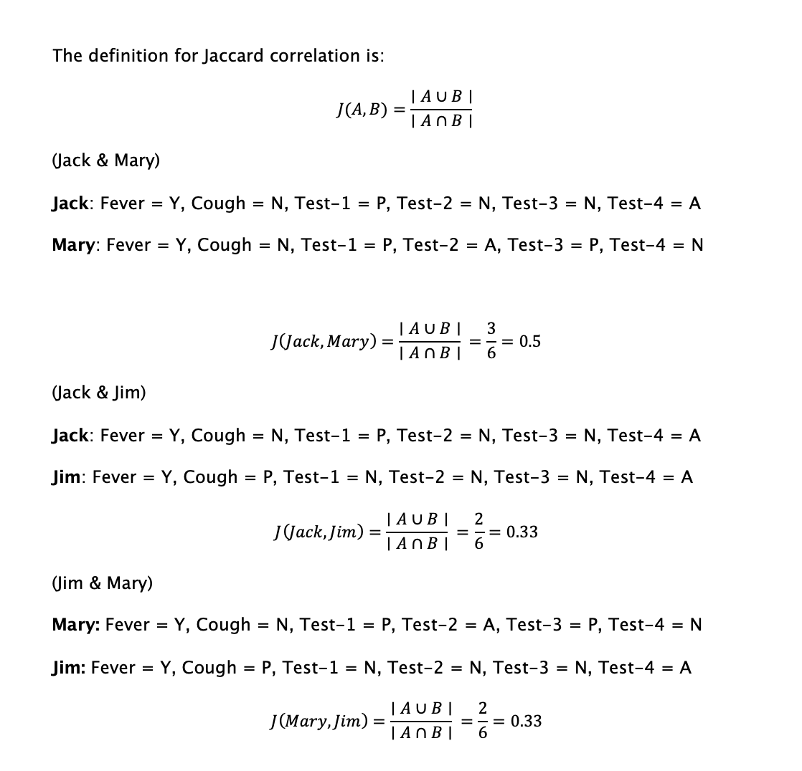

## Unit 6: Development Team Project
During this unit we submitted a Development Team Project where we were asked to complete an analytical report. 

You can find the report [here](assets/ml/TeamProjectReport.docx) and the Jupyter notebook here: [Unit 6 Notebook](https://github.com/RalucaGH/RG/blob/main/assets/ml/exploratory_analysis_edited_4.ipynb)

## Unit 6: K-Means Clustering
In this activity we were asdked to perform K-mean Clustering on a dataset. 

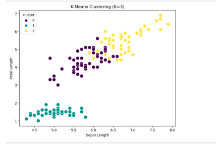

Full code below:

[Unit 6 Notebook](https://github.com/RalucaGH/RG/blob/main/assets/ml/Unit6done.ipynb)

## Unit 7: Perceptron Activities

Exercise 1 Simple Perceptron: Changing the input values from [45, 25] to [20, 75]; and the weights from [- 0.7, 0.1]  to: [0.8, 0.3] resulted in neuron activation. Keeping the same inputs: [45, 25] but changing the weights to [1.0, 0.5] resulted in the neuron not being activated. 

Full code below: 

[Unit 7 Notebook 1](https://github.com/RalucaGH/RG/blob/main/assets/ml/Unit07Ex1simple_perceptron.ipynb)

[Unit 7 Notebook 2](https://github.com/RalucaGH/RG/blob/main/assets/ml/Unit07Ex2perceptron_AND_operator.ipynb)

[Unit 7 Notebook 3](https://github.com/RalucaGH/RG/blob/main/assets/ml/Unit07Ex3multi-layerPerceptron.ipynb)

## Unit 8: Gradient Cost Function
This exercise had the goal of reaching minimum cost with minimum iteration. Original had 100 iterations and a learning rate of 0.8. 

The decrease can be seen in the following, with 50 iterations and a learning rate of 0.7:

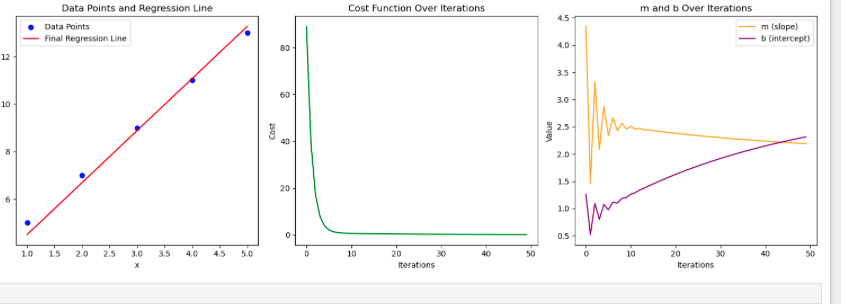

Full code below:

[Unit 8 Notebook ](https://github.com/RalucaGH/RG/blob/main/assets/ml//Unit08Ex4gradient_descent_cost_function.ipynb)

## Unit 8-10: Legal and Ethical views on ANN applications

In the past decade, the use of AI has grown significantly, with Salminen and Mauladhika (2025) describing it as "an indispensable part of our digital and professional lives." AI integration into daily life has brought numerous advantages, including improved efficiency and productivity, enhanced customer experiences, ease of generating quality content, and increased data-driven decision-making. AI's ability to identify patterns has led to greater automation across industries. For instance, in healthcare, AI aids in diagnosing and treating diseases, while in public safety, it is used to improve security and detect crime. The energy industry employs AI to boost efficiency, and it also plays a crucial role in fraud detection and prevention (Google, 2024).  

However, despite its many benefits, unregulated AI implementation raises significant ethical concerns (European Council, 2024). One of the primary issues is the lack of transparency regarding AI algorithms and training data. Machine learning (ML) models often function as "black boxes," where the inputs and outputs are visible, but the internal decision-making processes within hidden layers remain opaque (China, 2024).  

Another concern is data quality and bias. Poorly cleansed or biased data can lead to harmful outcomes, particularly for underrepresented communities (Arena, 2022; European Council, 2024; Hutson, 2021). These issues are exacerbated by the absence of robust regulations and safeguards, which also raise serious concerns about data privacy (Arena, 2022; European Council, 2024).  
Whilst AI offers a range of benefits across various domains, its unregulated implementation poses ethical risks, including bias, transparency issues, and data privacy concerns. As AI technologies like robo-writers become increasingly prevalent, careful consideration of these challenges is essential to ensure responsible use and equitable impact.  

Reference list:

Arena, C. (2022). 7 Disadvantages of Artificial Intelligence Everyone Should Know About. [online] Liberties.eu. Available at: https://www.liberties.eu/en/stories/disadvantages-of-artificial-intelligence/44289.
China, C. (2024). Artificial Intelligence Advantages & Disadvantages. IBM. [online] Ibm.com. Available at: https://www.ibm.com/think/insights/artificial-intelligence-advantages-disadvantages.
European Council. (2024). Benefits and risks of AI. [online] Available at: https://www.consilium.europa.eu/en/policies/benefits-and-risks-of-ai/#benefits.
Google (2024). Applications of Artificial Intelligence (AI). [online] Google Cloud. Available at: https://cloud.google.com/discover/ai-applications.
Hutson, M. (2021). Robo-writers: the rise and risks of language-generating AI. Nature, [online] 591(7848), pp.22–25. doi:https://doi.org/10.1038/d41586-021-00530-0.
Salminen, M. and Mauladhika, B.F. (2023). AI statistics and trends: New research for 2025. [online] Hostinger Tutorials.
Available at: https://www.hostinger.com/tutorials/ai-statistics?gad_source=1&gbraid=0AAAAADMy-hZZAKuLXk7X_LCvwUlCzr75O&gclid=EAIaIQobChMI0piq9ZyUiwMVhZJQBh13kxp7EAAYASAAEgImUfD_BwE.

## Unit 9: Social implications of CNN technology

Facial recognition technology refers to software that identifies individuals by comparing their facial features to a database of digital images or videos (BSIA, 2021). While this technology offers potential benefits, such as enhanced public safety and policing, and has been described as "a technology designed to improve the safety and well-being of people" (Home Office, 2021), it raises significant ethical concerns.  

Wall (2019) highlights that facial recognition systems have a high error rate, particularly when identifying individuals from diverse demographics. Leslie (2020) further argues that such software can infringe on civil liberties and basic human rights, perpetuating structural racism and marginalization. Almeida et al. (2021) emphasize that using these systems without accountability for flawed or biased algorithms can exacerbate victimization and discrimination of underrepresented communities, eroding trust in law enforcement agencies. 

A notable example of these issues is the case of *R. (Bridges) v. Chief Constable of South Wales Police [2020], where the Court of Appeal ruled that the use of facial recognition technology was unlawful as it violated the right to privacy under the Human Rights Act (1998) and the Data Protection Act (2018) (Gov.uk, n.d). Moreover, advancements in models capable of recognizing partially covered faces risk infringing on individuals’ right to opt out of surveillance (Gov.uk, n.d).  

While facial recognition technology holds promise for improving public safety, its ethical implications—including biases, infringement on civil liberties, and privacy violations—highlight the need for strict accountability, transparency, and regulation to ensure its responsible and equitable use.  

Reference list:

1.	Almeida, D., Shmarko, K. and Lomas, E. (2021). The ethics of facial recognition technologies, surveillance, and accountability in an age of artificial intelligence: a comparative analysis of US, EU, and UK regulatory frameworks. AI and Ethics, 2(3), pp.377–387. doi:https://doi.org/10.1007/s43681-021-00077-w.
2.	BSIA (2021). Automated Facial Recognition A guide to ethic al a nd leg al use. [online] British Security Industry Association. Available at: https://www.bsia.co.uk/zappfiles/bsia-front/pdf2024/347-automated-facial-recognition-a-guide-to-ethical-and-legal-use.pdf.
3.	GOV.UK. (n.d.). Briefing note on the ethical issues arising from public–private collaboration in the use of live facial recognition technology (accessible). [online] Available at: https://www.gov.uk/government/publications/public-private-use-of-live-facial-recognition-technology-ethical-issues/briefing-note-on-the-ethical-issues-arising-from-public-private-collaboration-in-the-use-of-live-facial-recognition-technology-accessible.
4.	Home Office (2021). Automated Facial Recognition: ethical and legal use. [online] GOV.UK. Available at: https://www.gov.uk/government/publications/automated-facial-recognition-ethical-and-legal-use.
5.	Leslie, D. (2020). Understanding Bias in Facial Recognition Technologies. The Alan Turing Institute. [online] doi:https://doi.org/10.5281/zenodo.4050457.
6.	Wall, M. (2019). Biased and wrong? Facial recognition tech in the dock. BBC News. [online] 8 Jul. Available at: https://www.bbc.co.uk/news/business-48842750.

## Unit 9: CNN Tutorial

Below are predictions for 6 images:

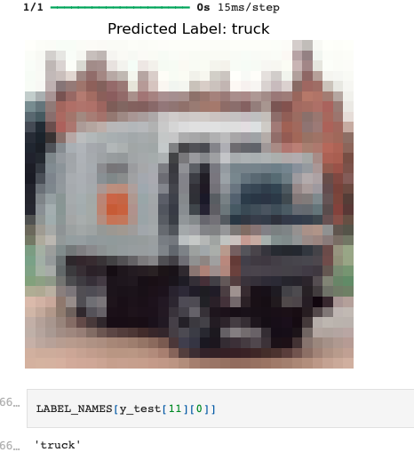

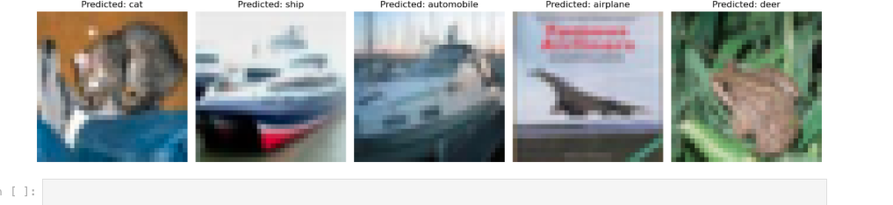

During running the CNN notebook, I had to do two minor changes in the code as predict_classes was removed from TensorFlow as well as changing the code for the plots for the predictions as it was throwing out errors. I plotted 5 different images with their predictions and the model got the images right 4 out of 5 times. This is reasonable for an accuracy of 65%. The model does well for some classes (airplane, automobile, horse, ship, truck (over 70% accuracy) but performs really poorly for cat and dog (less than 50% accuracy). The model is also overfitting. This can be mitigated with data augmentation, cross-validation and further hyperparameter tuning. 

Full code below:

[Unit 9 Notebook](https://github.com/RalucaGH/RG/blob/main/assets/ml/Unit09Ex1ConvolutionalNeuralNetworks(CNN)-ObjectRecognition.ipynb)

## Unit 11: Model Performance Measurement
This activity involved changing the parameters and observing how the model performs:

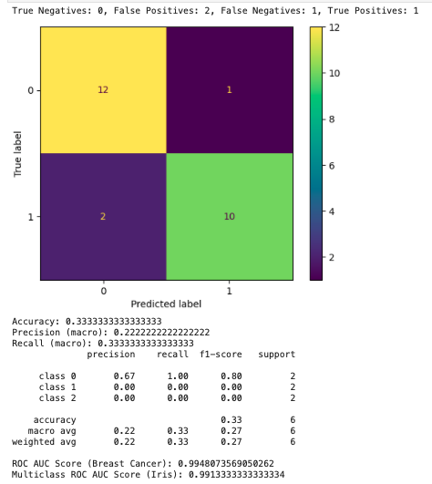

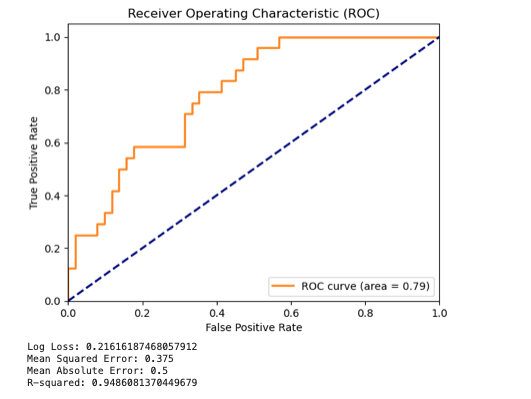

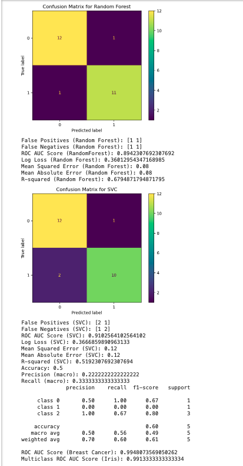

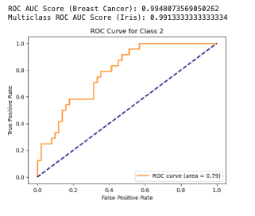

Full code below:

[Unit 11 Notebook](https://github.com/RalucaGH/RG/blob/main/assets/ml/Unit11_model_Performance_Measurement.ipynb)

## Unit 11: Individual Development project on CIFAR-10

This unit also contained an individual development project. Final model performance below:

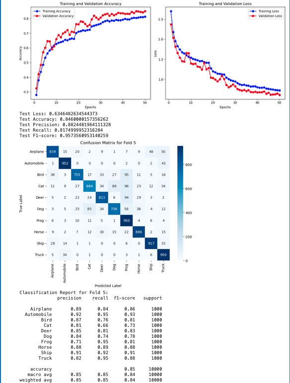

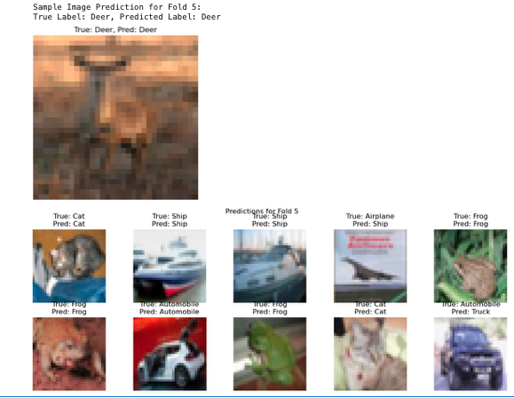

Full training process:
[Unit 11 Notebook CNN](https://github.com/RalucaGH/RG/blob/main/assets/ml/CNN.ipynb)

Final model and model performance:
[Unit 11 Notebook Final CNN and performance](https://github.com/RalucaGH/RG/blob/main/assets/ml/CNNChosenmodelplusmodelperformance.ipynb)

## Individual Reflection

At the start of the module, my knowledge of machine learning was limited to using Language Models such as ChatGPT. Engaging in this module has offered me both the technical skills and insights required to understand the field at a deeper level. 

During the first three modules, the collaborative discussion introduced both the advantages and disadvantages as well as the ethical dilemmas that the field is riddled with. It was interesting to see the subtle way the world is shaped with the help of different machine learning models, and to grasp at the dangers of over-relying on technology. The cascading effect on whole populations truly highlights the need for robust testing and contingency planning- both processes that directly apply to machine learning models, where errors and biases can result in significant consequences.

The exercise in Unit 2 was focused on pre-processing data and Exploratory Data Analysis. This exercise showed me the importance of good EDA techniques in identifying patterns in the data. Whilst I completed the exercises, I now recognize the need to improve my ability to create visually appealing and informative plots to better communicate insights. 

The exercise in Unit 3 was focussed on modifying parameters and observing the impact this has on the correlation between variables, as well as on regression. In Unit 4, we looked at practical applications of scikit-learn for correlation and regression. Looking back, the exercise in unit three and the reading in unit four helped me understand hyperparameter tuning and how small changes can have big impacts. 
Unit 5 was focussed on different types of clustering, techniques and evaluating clusters introducing me to unsupervised learning. The exercise in this unit was focused on calculating Jaccard coefficients. Despite the challenges posed by the mathematics behind clustering, I gained valuable insights into how to interpret cluster evaluation metrics and their real-world applications.

In Unit 6, we have submitted a group project where I contributed by creating plot variations for diversity, performing multiple regression analyses, and implementing random forest algorithms. This exercise was particularly useful to get hands on experience with using basic machine learning techniques, as well as highlighting the value of different perspectives. Aside from this I also completed the K-means clustering exercise which was a great way to apply the knowledge gained in the previous unit. 

Unit 7 was an introduction to Artificial Neural Networks and the mathematics behind the multilevel perceptron and the different types of activation functions. The Perceptron activities were useful to clarify the concepts and show the practical applications. It was interesting to see how mathematical concepts can be applied in a practical manner. Unit 8 was a continuation of this, focused on model training and backpropagation and it was exciting to see how models learn and what we can do to make them more efficient. In this unit we also looked at ethical views on ANN applications, which further developed and build upon the discussion in Unit 1. 

The exercise in Unit 9 further looked at ethics but in the case of facial recognition software. This discussion was the most interesting of them as it provided a broader perspective on the societal implications of machine learning models. The other exercise in this module was a CIFAR-10 model whereby we had to make a prediction. The CNN was continued in unit 10, where the reading list helped me deepen my knowledge especially around hyperparameter tuning.
In unit eleven, we looked at model performance and how to evaluate performance. This was especially useful for the Individual development Project, where we had to build, deploy and tune an object recognition model based on the CIFAR-10 dataset. Without using a pre-trained model, I managed to get my model at 85% accuracy with little overfitting which was major turning point in my learning journey, as I had never developed such a model from scratch. Finally, the last unit gave insight on the future on machine learning.

This module had a profound impact on my professional development. The technical knowledge and hands-on experience gained throughout the course have significantly enhanced my capabilities in machine learning. I now feel confident in building, deploying, and evaluating models, as well as in identifying areas for improvement through hyperparameter tuning and performance metrics.
The emphasis on ethics has shaped my approach to machine learning projects. The collaborative discussion helped me understand the importance of transparency, fairness, and accountability in algorithm development. Furthermore, I also developed a solid understanding of the mathematical aspects behind different models which in turn helped me better understand their limitation. The development projects showed me how important is to keep the development clean and keep track of all the parameter changes.

Some of improvement areas noted throughout this module are the need for more understanding of hyperparameter tuning, the need for advanced data visualisation techniques, and limited understanding of the mathematics behind it. Going forward I plan to further explore Matplotlib and Seaborn, do further reading in model training and take a Mathematics course to brush on my knowledge. 

### [Home](README.md)
 

