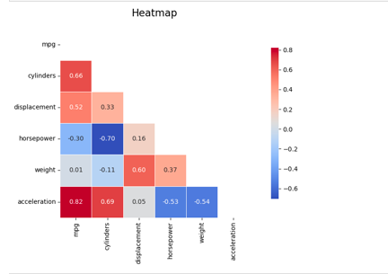
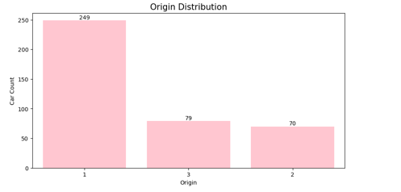
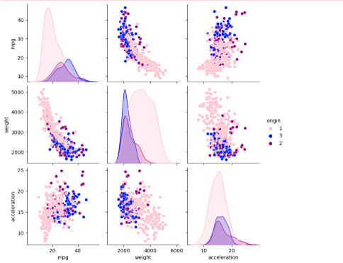
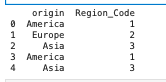
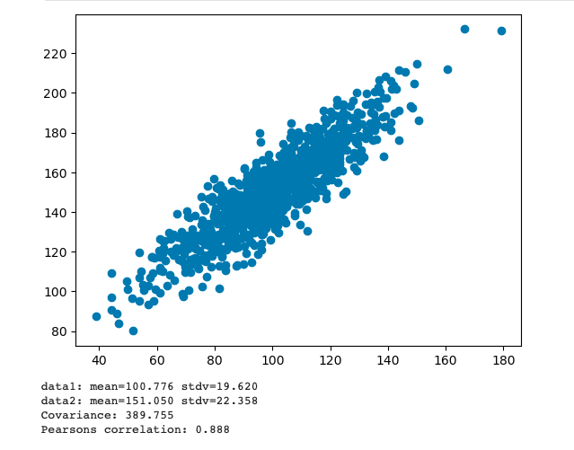

### Machine Learning

## Learning Outcomes 
1. Articulate the legal, social, ethical and professional issues faced by machine learning professionals.
2. Understand the applicability and challenges associated with different datasets for the use of machine learning algorithms.
3. Apply and critically appraise machine learning techniques to real-world problems, particularly where technical risk and uncertainty is involved.
4. Systematically develop and implement the skills required to be effective member of a development team in a virtual professional environment, adopting real-life perspectives on team roles and organisation.

## Units 1-3: Collaborative Discussion 1
Schwab (2016) argues that the Fourth Industrial Revolution will fundamentally alter the way we exist and that the response to it needs to be integrated, comprehensive, and inclusive of all relevant stakeholders. He also argues that the speed of these breakthroughs has no historical precedent (Schwab, 2016). This is evident in the increasing reliance on technology, particularly telecommunication and the internet. Millions of people are now connected to the internet via mobile phones augmented with AI, forming a complex structural web (Schwab, 2016). 
The critical dependence on the Internet of Things (IoT) was illustrated during one of the most significant telecommunication outages in recent Australian history. In 2023, ten million Optus users were left without phone coverage or internet (Sharwood, 2023; Farrer & Taylor, 2023). The outage had far-reaching consequences, halting key government services such as transport and health (Farrer & Taylor, 2023) and disrupting SMS authentication and payment systems (Clark, 2024). It was reported that 228 triple-0 emergency calls could not connect, leaving individuals unable to contact emergency services (Williams, 2023).
The fallout from the outage was extensive, leading to the government reconsidering contracts with Optus (Farrer & Taylor, 2023), the resignation of the company’s CEO, a $40 million financial loss, 2% decline in business, and multiple investigations into the incident (Clark, 2024). The outage was attributed to a botched software update caused by human error, resulting in a cascading failure when routing information exceeded preset safety levels on key routers. Experts noted that more robust testing processes, such as internal system tests and router evaluations, could have prevented the incident (Gregory, 2023; Page, 2023).
Furthermore, an inquiry by the Australian Senate revealed that Optus had no contingency plan for large-scale outages (Page, 2023). The review emphasized the need for the Australian Government to improve oversight of telecommunication providers, especially concerning emergency services, and to establish stronger protocols for responding to national service outages (Australian Government, 2024).

The Optus outage highlights the vulnerabilities of modern societies reliance on IoT and telecommunication networks. It highlights the importance of robust testing protocols, effective contingency plans, and proactive government oversight to prevent and mitigate the consequences of such failures. 
Reference list
1.	Australian Government (2024). Review into the Optus outage of 8 November 2023 – Recommendations. [online] Department of Infrastructure, Transport, Regional Development, Communications and the Arts. Available at: https://www.infrastructure.gov.au/department/media/publications/review-optus-outage-8-november-2023-recommendations.
2.	Clark, R. (2024). Optus network crash cost the company $40M. [online] Lightreading.com. Available at: https://www.lightreading.com/finance/optus-network-crash-cost-the-company-40m.
3.	Farrer, M. and Taylor, J. (2023). Half of Australia left without internet or phone as Optus crashes. [online] The Guardian. Available at: https://www.theguardian.com/business/2023/nov/08/half-of-australia-left-without-internet-or-phone-as-optus-crashes.
4.	Gregory, M.A. (2023). An Analysis of the Optus National Outage and Recommendations for Enhanced Regulation. Australian Journal of Telecommunications and the Digital Economy, 11(4), pp.185–198. doi:https://doi.org/10.18080/jtde.v11n4.898.
5.	Page, R. (2023). What CIOs can learn from the massive Optus outage. [online] CIO. Available at: https://www.cio.com/article/1249111/what-cios-can-learn-from-the-massive-optus-outage.html.
6.	Perfetto, I. (2023). The cause behind the Optus outage explained. [online] cosmosmagazine.com. Available at: https://cosmosmagazine.com/technology/internet/the-cause-behind-the-optus-outage-explained/.
7.	Schwab, K. (2016). The Fourth Industrial Revolution: what it means and how to respond. [online] World Economic Forum. Available at: https://www.weforum.org/stories/2016/01/the-fourth-industrial-revolution-what-it-means-and-how-to-respond/.
8.	Sharwood, S. (2023). Telco CEO quits after admitting she needs to carry rivals’ SIM cards to stay in touch. [online] Theregister.com. Available at: https://www.theregister.com/2023/11/21/optus_ceo_quits/.
9.	Williams, T. (2023). Urgent meetings, router resets and 400 workers: Behind the scenes of the Optus outage. ABC News. [online] 22 Nov. Available at: https://www.abc.net.au/news/2023-11-22/optus-outage-documents-behind-the-scenes-two-weeks-since/103130998.

## Unit 2: EDA Tutorial

In this unit we were encouraged to perform EDA on the Auto-MPG dataset:

Identify missing values:

Estimate Skewness and Kurtosis:

Correlation Heat Map:

Plots for different parameters:

Replace categorical values with numerical values (i.e., America 1, Europe 2 etc.):

All code can be found here: 

[Unit 2 Notebook](https://github.com/RalucaGH/RG/blob/main/assets/ml/unit2ML.ipynb)

## Unit 3: Correlation and Regression
In this unit we used jupyter notebooks to modify the parameters and observe how the changes in data affects correlation and regression.

1. Pearson correlation - Below you can see the changes to the correlation due to changing of covariance
[Unit 3 Notebook 1](https://github.com/RalucaGH/RG/blob/main/assets/ml/Unit03Ex1covariance_pearson_correlation_done.ipynb)

 -> 

[Unit 3 Notebook 2](https://github.com/RalucaGH/RG/blob/main/assets/ml/Unit03Ex2linear_regression_done.ipynb)

[Unit 3 Notebook 3](https://github.com/RalucaGH/RG/blob/main/assets/ml/Unit03Ex3multiple_linear_regressiondone.ipynb)

[Unit 3 Notebook 4](https://github.com/RalucaGH/RG/blob/main/assets/ml/Unit03Ex4polynomial_regression_done.ipynb)

## Units 4: Linear Regression with Scikit-Learn

## Unit 5: Jaccard Coefficient Calculations

## Unit 6: K-Means Clustering

## Unit 7: Perceptron Activities

## Unit 8: Gradient Cost Function

## Unit 8-10: Legal and Ethical views on ANN applications

## Unit 9: CNN Model Activity

## Unit 10: CNN Tutorial

## Unit 11: Model Performance Measurement

## Unit 12: Future of Machine Learning

 

